# EV Co-ownership & Cost-sharing System - Use Case Diagram

## System: EV Co-ownership & Cost-sharing System
**Phần mềm quản lý đồng sở hữu & chia sẻ chi phí xe điện**

## Actors:
- **Co-owner** (Chủ xe đồng sở hữu)
- **Staff** (Nhân viên vận hành) 
- **Admin** (Quản trị viên hệ thống)

## Use Case Diagram (Mermaid)

```mermaid
graph TB
    %% Actors
    CoOwner[👤 Co-owner<br/>Chủ xe đồng sở hữu]
    Staff[👨‍💼 Staff<br/>Nhân viên vận hành]
    Admin[👨‍💻 Admin<br/>Quản trị viên]
    
    %% System Boundary
    subgraph System["🚗 EV Co-ownership & Cost-sharing System"]
        
        %% Co-owner Use Cases - Account & Ownership Management
        subgraph AccountMgmt["Quản lý tài khoản & quyền sở hữu"]
            UC1[Đăng ký & Xác thực<br/>CMND/CCCD, GPLX]
            UC2[Quản lý Tỷ lệ Sở hữu<br/>VD: A 40%, B 30%, C 30%]
            UC3[Quản lý Hợp đồng<br/>E-contract]
        end
        
        %% Co-owner Use Cases - Scheduling & Usage
        subgraph Scheduling["Đặt lịch & sử dụng xe"]
            UC4[Xem Lịch Chung<br/>Trống/Đang sử dụng]
            UC5[Đặt Lịch Sử dụng<br/>Ưu tiên công bằng]
        end
        
        %% Co-owner Use Cases - Cost & Payment
        subgraph CostMgmt["Chi phí & thanh toán"]
            UC6[Quản lý Chi phí<br/>Tự động chia theo tỷ lệ]
            UC7[Báo cáo Chi phí<br/>Tháng/Quý]
            UC8[Thanh toán Trực tuyến<br/>E-wallet, Banking]
        end
        
        %% Co-owner Use Cases - History & Analysis
        subgraph History["Lịch sử & phân tích"]
            UC9[Lịch sử Sử dụng<br/>Thời gian, Quãng đường]
            UC10[Phân tích Cá nhân<br/>So sánh với tỷ lệ sở hữu]
        end
        
        %% Co-owner Use Cases - Group Management
        subgraph GroupMgmt["Nhóm đồng sở hữu"]
            UC11[Quản lý Nhóm<br/>Thêm/Xóa thành viên]
            UC12[Bỏ phiếu Quyết định<br/>Nâng cấp pin, Bảo hiểm]
            UC13[Quỹ chung<br/>Bảo dưỡng, Dự phòng]
            UC14[AI Gợi ý<br/>Phân tích sử dụng]
        end
        
        %% Staff Use Cases
        subgraph StaffUC["Chức năng Nhân viên"]
            UC15[Quản lý Nhóm xe<br/>Đồng sở hữu]
            UC16[Quản lý Hợp đồng<br/>Pháp lý điện tử]
            UC17[Check-in/Check-out<br/>QR, Ký số]
            UC18[Quản lý Dịch vụ xe<br/>Bảo dưỡng, Sửa chữa]
            UC19[Giám sát Tranh chấp<br/>Xử lý mâu thuẫn]
            UC20[Báo cáo Tài chính<br/>Minh bạch cho nhóm]
        end
        
        %% Admin Use Cases
        subgraph AdminUC["Chức năng Admin"]
            UC21[Quản lý Hệ thống<br/>Cấu hình, Bảo trì]
            UC22[Quản lý Người dùng<br/>Phân quyền, Vai trò]
            UC23[Backup & Recovery<br/>Sao lưu, Khôi phục]
        end
        
        %% External Systems
        subgraph External["Hệ thống Bên ngoài"]
            UC24[E-wallet<br/>Ví điện tử]
            UC25[Banking<br/>Ngân hàng]
            UC26[QR Code<br/>Mã QR]
            UC27[Digital Signature<br/>Chữ ký số]
        end
    end
    
    %% Co-owner Relationships
    CoOwner --> UC1
    CoOwner --> UC2
    CoOwner --> UC3
    CoOwner --> UC4
    CoOwner --> UC5
    CoOwner --> UC6
    CoOwner --> UC7
    CoOwner --> UC8
    CoOwner --> UC9
    CoOwner --> UC10
    CoOwner --> UC11
    CoOwner --> UC12
    CoOwner --> UC13
    CoOwner --> UC14
    
    %% Staff Relationships
    Staff --> UC15
    Staff --> UC16
    Staff --> UC17
    Staff --> UC18
    Staff --> UC19
    Staff --> UC20
    
    %% Admin Relationships
    Admin --> UC21
    Admin --> UC22
    Admin --> UC23
    
    %% External System Relationships
    UC8 --> UC24
    UC8 --> UC25
    UC17 --> UC26
    UC3 --> UC27
    UC16 --> UC27
    
    %% Include Relationships (dotted lines)
    UC1 -.->|includes| UC2
    UC1 -.->|includes| UC3
    UC5 -.->|includes| UC4
    UC6 -.->|includes| UC7
    UC9 -.->|includes| UC10
    UC11 -.->|includes| UC12
    UC11 -.->|includes| UC13
    UC14 -.->|includes| UC9
    
    %% Extend Relationships (dotted lines)
    UC5 -.->|extends| UC14
    UC6 -.->|extends| UC24
    UC6 -.->|extends| UC25
    
    %% Dependencies (dashed lines)
    UC15 -.->|depends on| UC11
    UC16 -.->|depends on| UC3
    UC17 -.->|depends on| UC5
    UC18 -.->|depends on| UC6
    UC19 -.->|depends on| UC12
    UC20 -.->|depends on| UC7
    
    %% Styling
    classDef actor fill:#e1f5fe,stroke:#01579b,stroke-width:2px
    classDef coownerUC fill:#f3e5f5,stroke:#4a148c,stroke-width:2px
    classDef staffUC fill:#e8f5e8,stroke:#1b5e20,stroke-width:2px
    classDef adminUC fill:#fff3e0,stroke:#e65100,stroke-width:2px
    classDef externalUC fill:#fce4ec,stroke:#880e4f,stroke-width:2px
    
    class CoOwner,Staff,Admin actor
    class UC1,UC2,UC3,UC4,UC5,UC6,UC7,UC8,UC9,UC10,UC11,UC12,UC13,UC14 coownerUC
    class UC15,UC16,UC17,UC18,UC19,UC20 staffUC
    class UC21,UC22,UC23 adminUC
    class UC24,UC25,UC26,UC27 externalUC
```

## Use Case Categories

### 1. Co-owner (Chủ xe đồng sở hữu) - 14 Use Cases

#### A. Quản lý tài khoản & quyền sở hữu
- **UC1**: Đăng ký & Xác thực (CMND/CCCD, GPLX)
- **UC2**: Quản lý Tỷ lệ Sở hữu (VD: A 40%, B 30%, C 30%)
- **UC3**: Quản lý Hợp đồng E-contract

#### B. Đặt lịch & sử dụng xe
- **UC4**: Xem Lịch Chung (Trống/Đang sử dụng)
- **UC5**: Đặt Lịch Sử dụng (Ưu tiên công bằng)

#### C. Chi phí & thanh toán
- **UC6**: Quản lý Chi phí (Tự động chia theo tỷ lệ)
- **UC7**: Báo cáo Chi phí (Tháng/Quý)
- **UC8**: Thanh toán Trực tuyến (E-wallet, Banking)

#### D. Lịch sử & phân tích
- **UC9**: Lịch sử Sử dụng (Thời gian, Quãng đường)
- **UC10**: Phân tích Cá nhân (So sánh với tỷ lệ sở hữu)

#### E. Nhóm đồng sở hữu
- **UC11**: Quản lý Nhóm (Thêm/Xóa thành viên)
- **UC12**: Bỏ phiếu Quyết định (Nâng cấp pin, Bảo hiểm)
- **UC13**: Quỹ chung (Bảo dưỡng, Dự phòng)
- **UC14**: AI Gợi ý (Phân tích sử dụng)

### 2. Staff (Nhân viên vận hành) - 6 Use Cases
- **UC15**: Quản lý Nhóm xe (Đồng sở hữu)
- **UC16**: Quản lý Hợp đồng (Pháp lý điện tử)
- **UC17**: Check-in/Check-out (QR, Ký số)
- **UC18**: Quản lý Dịch vụ xe (Bảo dưỡng, Sửa chữa)
- **UC19**: Giám sát Tranh chấp (Xử lý mâu thuẫn)
- **UC20**: Báo cáo Tài chính (Minh bạch cho nhóm)

### 3. Admin (Quản trị viên) - 3 Use Cases
- **UC21**: Quản lý Hệ thống (Cấu hình, Bảo trì)
- **UC22**: Quản lý Người dùng (Phân quyền, Vai trò)
- **UC23**: Backup & Recovery (Sao lưu, Khôi phục)

### 4. External Systems (Hệ thống bên ngoài) - 4 Use Cases
- **UC24**: E-wallet (Ví điện tử)
- **UC25**: Banking (Ngân hàng)
- **UC26**: QR Code (Mã QR)
- **UC27**: Digital Signature (Chữ ký số)

## Key Relationships

### Include Relationships (Bao gồm)
- Đăng ký & Xác thực **includes** Quản lý Tỷ lệ Sở hữu
- Đăng ký & Xác thực **includes** Quản lý Hợp đồng E-contract
- Đặt Lịch Sử dụng **includes** Xem Lịch Chung
- Quản lý Chi phí **includes** Báo cáo Chi phí
- Lịch sử Sử dụng **includes** Phân tích Cá nhân
- Quản lý Nhóm **includes** Bỏ phiếu Quyết định
- Quản lý Nhóm **includes** Quỹ chung
- AI Gợi ý **includes** Lịch sử Sử dụng

### Extend Relationships (Mở rộng)
- Đặt Lịch Sử dụng **extends** AI Gợi ý
- Quản lý Chi phí **extends** E-wallet Integration
- Quản lý Chi phí **extends** Banking Integration

### Dependencies (Phụ thuộc)
- Quản lý Nhóm xe **depends on** Quản lý Nhóm
- Quản lý Hợp đồng Pháp lý **depends on** Quản lý Hợp đồng E-contract
- Check-in/Check-out **depends on** Đặt Lịch Sử dụng
- Quản lý Dịch vụ xe **depends on** Quản lý Chi phí
- Giám sát Tranh chấp **depends on** Bỏ phiếu Quyết định
- Báo cáo Tài chính **depends on** Báo cáo Chi phí
