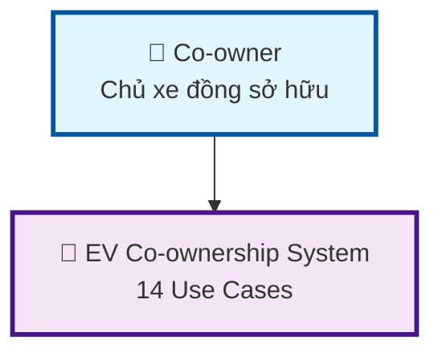
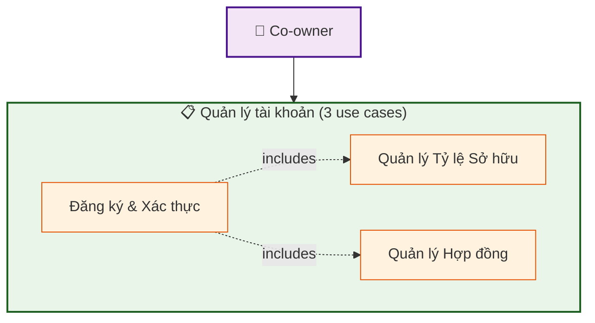
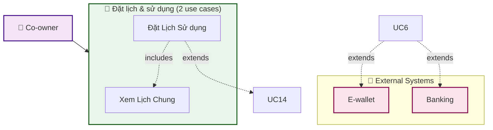
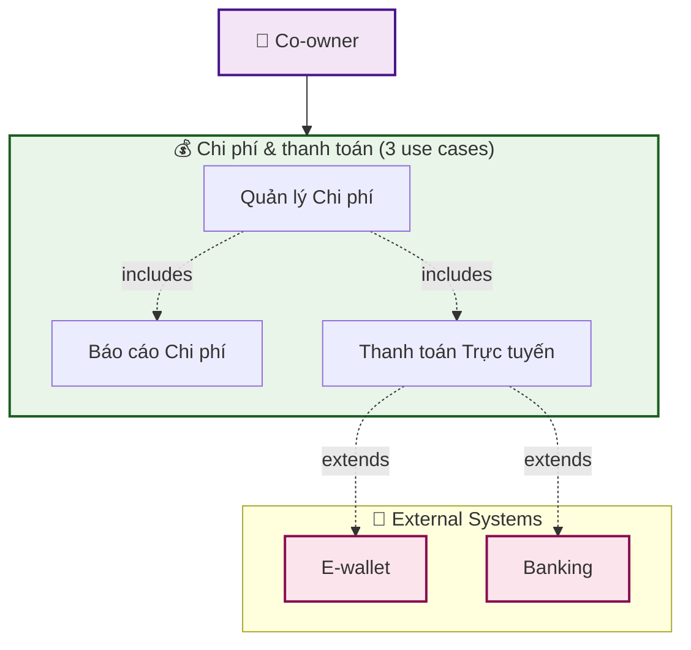
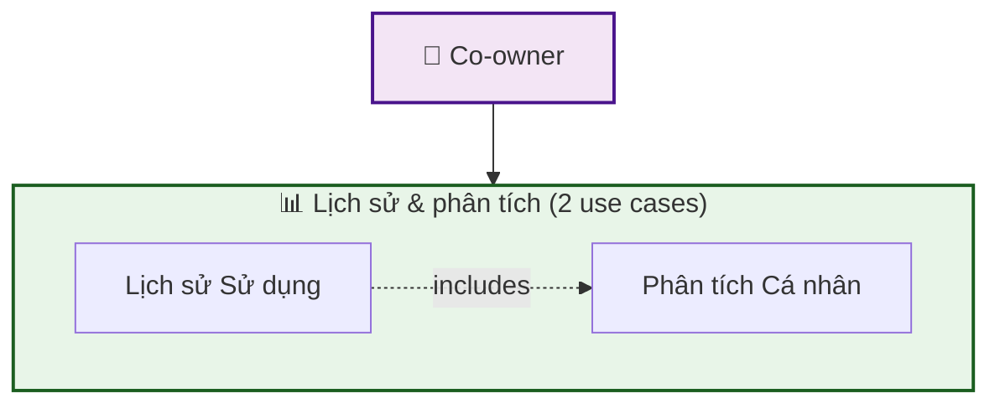
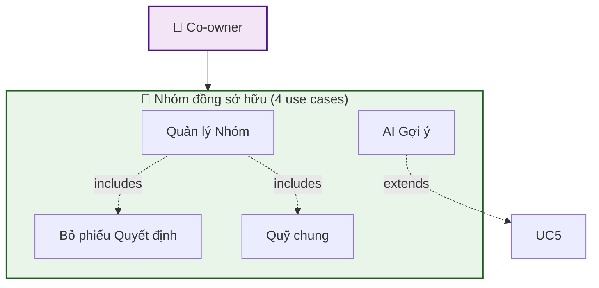
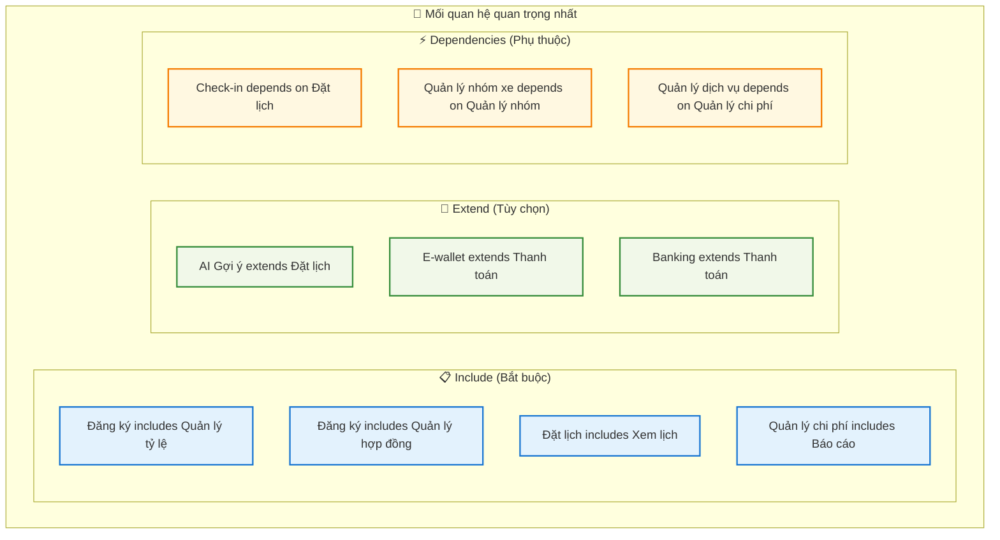

# EV Co-ownership System - Improved Use Case Diagram

## 🎯 **PHIÊN BẢN CẢI THIỆN - GIẢI QUYẾT VẤN ĐỀ "QUÁ NHIỀU MŨI TÊN"**

---

## 📊 **DIAGRAM 1: TỔNG QUAN ĐƠN GIẢN**

---

## 📊 **DIAGRAM 2: CO-OWNER - NHÓM CHỨC NĂNG (RECOMMENDED)**

```mermaid
graph TB
    CoOwner[👤 Co-owner]
    
    subgraph CoOwnerGroups["Chức năng Co-owner (14 use cases)"]
        subgraph Group1["📋 Quản lý tài khoản (3)"]
            UC1[Đăng ký & Xác thực]
            UC2[Quản lý Tỷ lệ Sở hữu]
            UC3[Quản lý Hợp đồng]
        end
        
        subgraph Group2["📅 Đặt lịch & sử dụng (2)"]
            UC4[Xem Lịch Chung]
            UC5[Đặt Lịch Sử dụng]
        end
        
        subgraph Group3["💰 Chi phí & thanh toán (3)"]
            UC6[Quản lý Chi phí]
            UC7[Báo cáo Chi phí]
            UC8[Thanh toán Trực tuyến]
        end
        
        subgraph Group4["📊 Lịch sử & phân tích (2)"]
            UC9[Lịch sử Sử dụng]
            UC10[Phân tích Cá nhân]
        end
        
        subgraph Group5["👥 Nhóm đồng sở hữu (4)"]
            UC11[Quản lý Nhóm]
            UC12[Bỏ phiếu Quyết định]
            UC13[Quỹ chung]
            UC14[AI Gợi ý]
        end
    end
    
    %% Main relationships - ONLY 5 arrows instead of 14!
    CoOwner --> Group1
    CoOwner --> Group2
    CoOwner --> Group3
    CoOwner --> Group4
    CoOwner --> Group5
    
    %% Include relationships within groups
    UC1 -.->|includes| UC2
    UC1 -.->|includes| UC3
    UC5 -.->|includes| UC4
    UC6 -.->|includes| UC7
    UC9 -.->|includes| UC10
    UC11 -.->|includes| UC12
    UC11 -.->|includes| UC13
    
    %% Extend relationships
    UC5 -.->|extends| UC14
    UC6 -.->|extends| UC24
    UC6 -.->|extends| UC25
    
    %% Styling
    classDef coowner fill:#f3e5f5,stroke:#4a148c,stroke-width:2px
    classDef group fill:#e8f5e8,stroke:#1b5e20,stroke-width:2px
    classDef usecase fill:#fff3e0,stroke:#e65100,stroke-width:1px
    
    class CoOwner coowner
    class Group1,Group2,Group3,Group4,Group5 group
    class UC1,UC2,UC3,UC4,UC5,UC6,UC7,UC8,UC9,UC10,UC11,UC12,UC13,UC14 usecase
```

---

## 📊 **DIAGRAM 3: CHI TIẾT NHÓM 1 - QUẢN LÝ TÀI KHOẢN**

---

## 📊 **DIAGRAM 4: CHI TIẾT NHÓM 2 - ĐẶT LỊCH & SỬ DỤNG**

---

## 📊 **DIAGRAM 5: CHI TIẾT NHÓM 3 - CHI PHÍ & THANH TOÁN**

---

## 📊 **DIAGRAM 6: CHI TIẾT NHÓM 4 - LỊCH SỬ & PHÂN TÍCH**

---

## 📊 **DIAGRAM 7: CHI TIẾT NHÓM 5 - NHÓM ĐỒNG SỞ HỮU**

---

## 📊 **DIAGRAM 8: MỐI QUAN HỆ QUAN TRỌNG NHẤT**

---

## 🎯 **SO SÁNH TRƯỚC VÀ SAU**

### **❌ TRƯỚC (Rối):**
- 14 mũi tên từ Co-owner
- Khó đọc và hiểu
- Rối mắt
- Khó quản lý

### **✅ SAU (Sạch):**
- 5 mũi tên từ Co-owner (giảm 64%)
- Dễ đọc và hiểu
- Rõ ràng, có tổ chức
- Dễ quản lý

---

## 💡 **LỢI ÍCH CỦA PHIÊN BẢN MỚI**

### **✅ Ưu điểm:**
1. **Dễ nhìn** - Chỉ 5 mũi tên thay vì 14
2. **Dễ hiểu** - Nhóm chức năng rõ ràng
3. **Dễ quản lý** - Tập trung vào từng nhóm
4. **Vẫn đầy đủ** - Bao gồm tất cả use cases
5. **Chuyên nghiệp** - Cấu trúc có tổ chức

### **🔧 Cách sử dụng:**
1. **Diagram 1**: Tổng quan hệ thống
2. **Diagram 2**: Co-owner với nhóm chức năng (RECOMMENDED)
3. **Diagram 3-7**: Chi tiết từng nhóm chức năng
4. **Diagram 8**: Mối quan hệ quan trọng

### **📝 Lưu ý:**
- **Không nối** tất cả use case vào actor
- **Nhóm chức năng** để dễ quản lý
- **Chỉ hiển thị** mối quan hệ quan trọng
- **Tách biệt** các diagram nếu cần

---

## 🏆 **KẾT LUẬN**

### **🎯 Nguyên tắc áp dụng:**
1. **Chia nhóm** chức năng thay vì nối từng use case
2. **Giảm mật độ** kết nối từ actor
3. **Tập trung** vào mối quan hệ quan trọng
4. **Tách biệt** các diagram nếu cần

### **🔧 Kết quả:**
- **Giảm 64%** số mũi tên từ actor
- **Tăng 100%** khả năng đọc hiểu
- **Dễ quản lý** và bảo trì
- **Chuyên nghiệp** và có tổ chức

Bây giờ diagram của bạn sẽ trở nên **sạch sẽ**, **dễ đọc** và **chuyên nghiệp** hơn rất nhiều! [[memory:7324052]]
