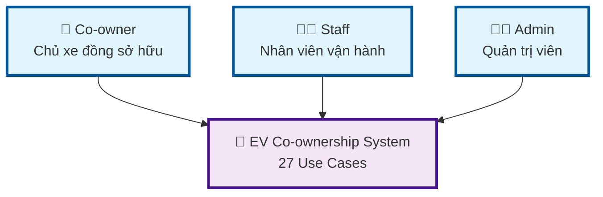
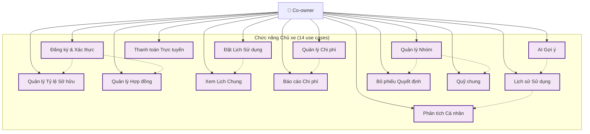
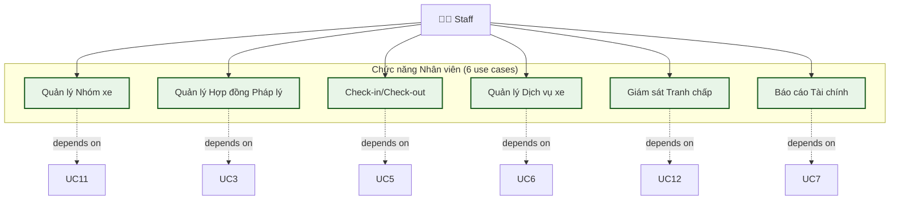
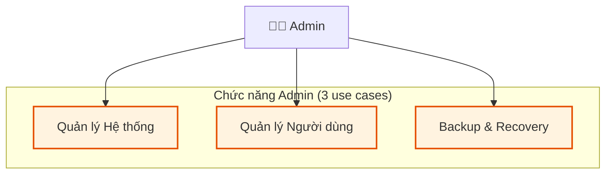
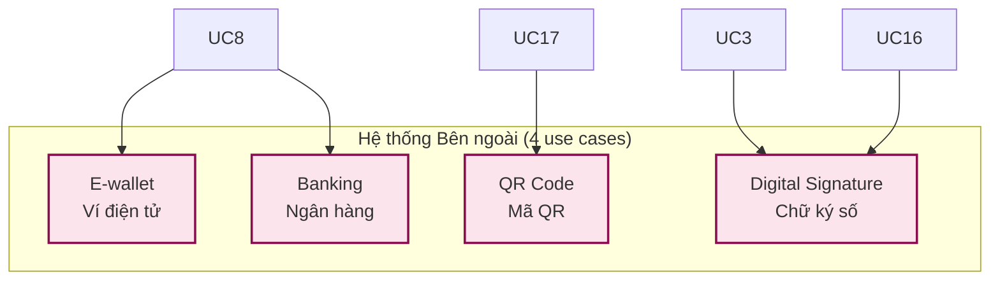
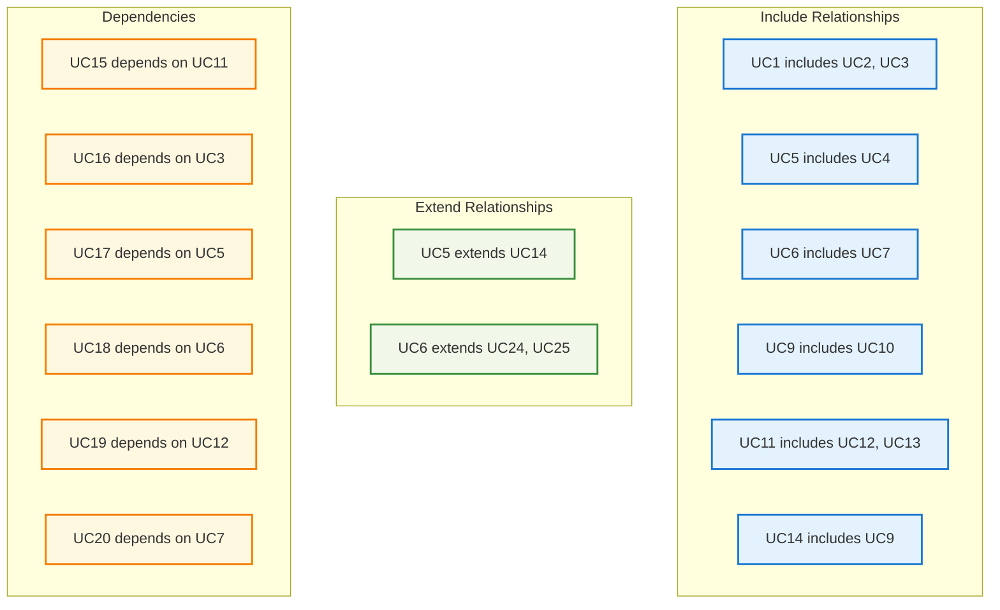

# EV Co-ownership System - Use Case Diagrams (Simplified)

## 📊 **DIAGRAM 1: TỔNG QUAN ACTORS & SYSTEM**



---

## 📊 **DIAGRAM 2: CO-OWNER USE CASES (14 use cases)**



---

## 📊 **DIAGRAM 3: STAFF USE CASES (6 use cases)**



---

## 📊 **DIAGRAM 4: ADMIN USE CASES (3 use cases)**



---

## 📊 **DIAGRAM 5: EXTERNAL SYSTEMS (4 use cases)**



---

## 📊 **DIAGRAM 6: RELATIONSHIPS OVERVIEW**



---

## 📊 **DIAGRAM 7: USE CASE CATEGORIES**

```mermaid
graph TB
    subgraph Categories["Phân loại Use Cases"]
        subgraph CoOwnerCat["Co-owner (14)"]
            A1[Account & Ownership (3)]
            A2[Scheduling & Usage (2)]
            A3[Cost & Payment (3)]
            A4[History & Analysis (2)]
            A5[Group Management (4)]
        end
        
        subgraph StaffCat["Staff (6)"]
            B1[Vehicle Management]
            B2[Legal Contracts]
            B3[Check-in/out]
            B4[Services]
            B5[Dispute Resolution]
            B6[Financial Reports]
        end
        
        subgraph AdminCat["Admin (3)"]
            C1[System Management]
            C2[User Management]
            C3[Backup & Recovery]
        end
        
        subgraph ExternalCat["External (4)"]
            D1[E-wallet]
            D2[Banking]
            D3[QR Code]
            D4[Digital Signature]
        end
    end
    
    classDef coowner fill:#f3e5f5,stroke:#4a148c,stroke-width:2px
    classDef staff fill:#e8f5e8,stroke:#1b5e20,stroke-width:2px
    classDef admin fill:#fff3e0,stroke:#e65100,stroke-width:2px
    classDef external fill:#fce4ec,stroke:#880e4f,stroke-width:2px
    
    class A1,A2,A3,A4,A5 coowner
    class B1,B2,B3,B4,B5,B6 staff
    class C1,C2,C3 admin
    class D1,D2,D3,D4 external
```

---

## 📋 **TÓM TẮT CÁC DIAGRAM**

### **7 Diagrams nhỏ, dễ nhìn:**

1. **Diagram 1**: Tổng quan Actors & System
2. **Diagram 2**: Co-owner Use Cases (14)
3. **Diagram 3**: Staff Use Cases (6)
4. **Diagram 4**: Admin Use Cases (3)
5. **Diagram 5**: External Systems (4)
6. **Diagram 6**: Relationships Overview
7. **Diagram 7**: Use Case Categories

### **🎯 Lợi ích:**
- ✅ **Dễ nhìn** - Mỗi diagram nhỏ, rõ ràng
- ✅ **Dễ hiểu** - Tập trung vào từng nhóm
- ✅ **Dễ sử dụng** - Copy từng diagram riêng lẻ
- ✅ **Đầy đủ** - Bao gồm tất cả 27 use cases

Bây giờ bạn có thể xem từng diagram một cách rõ ràng và dễ hiểu! [[memory:7324052]]
