# EV Co-ownership & Cost-sharing System - Use Case Diagram

## System Overview
**EV Co-ownership & Cost-sharing System** - Phần mềm quản lý đồng sở hữu & chia sẻ chi phí xe điện

## Actors
- **Co-owner** (Chủ xe đồng sở hữu)
- **Staff** (Nhân viên vận hành)
- **Admin** (Quản trị viên hệ thống)

## Use Case Diagram

```mermaid
graph TB
    %% Actors
    CoOwner[👤 Co-owner<br/>Chủ xe đồng sở hữu]
    Staff[👨‍💼 Staff<br/>Nhân viên vận hành]
    Admin[👨‍💻 Admin<br/>Quản trị viên]
    
    %% System Boundary
    subgraph System["🚗 EV Co-ownership & Cost-sharing System"]
        
        %% Co-owner Use Cases
        subgraph CoOwnerUC["Chức năng Chủ xe"]
            UC1[Đăng ký & Xác thực]
            UC2[Quản lý Tỷ lệ Sở hữu]
            UC3[Quản lý Hợp đồng E-contract]
            UC4[Xem Lịch Chung]
            UC5[Đặt Lịch Sử dụng]
            UC6[Quản lý Chi phí & Thanh toán]
            UC7[Xem Báo cáo Chi phí]
            UC8[Xem Lịch sử Sử dụng]
            UC9[Phân tích Cá nhân]
            UC10[Quản lý Nhóm]
            UC11[Bỏ phiếu Quyết định]
            UC12[Quản lý Quỹ chung]
            UC13[AI Gợi ý Sử dụng]
        end
        
        %% Staff Use Cases
        subgraph StaffUC["Chức năng Nhân viên"]
            UC14[Quản lý Nhóm xe]
            UC15[Quản lý Hợp đồng Pháp lý]
            UC16[Check-in/Check-out]
            UC17[Quản lý Dịch vụ xe]
            UC18[Giám sát Tranh chấp]
            UC19[Xuất Báo cáo Tài chính]
        end
        
        %% Admin Use Cases
        subgraph AdminUC["Chức năng Admin"]
            UC20[Quản lý Hệ thống]
            UC21[Quản lý Người dùng]
            UC22[Cấu hình Hệ thống]
            UC23[Backup & Recovery]
        end
        
        %% External Systems
        subgraph External["Hệ thống Bên ngoài"]
            UC24[E-wallet Integration]
            UC25[Banking Integration]
            UC26[QR Code System]
            UC27[Digital Signature]
        end
    end
    
    %% Co-owner Relationships
    CoOwner --> UC1
    CoOwner --> UC2
    CoOwner --> UC3
    CoOwner --> UC4
    CoOwner --> UC5
    CoOwner --> UC6
    CoOwner --> UC7
    CoOwner --> UC8
    CoOwner --> UC9
    CoOwner --> UC10
    CoOwner --> UC11
    CoOwner --> UC12
    CoOwner --> UC13
    
    %% Staff Relationships
    Staff --> UC14
    Staff --> UC15
    Staff --> UC16
    Staff --> UC17
    Staff --> UC18
    Staff --> UC19
    
    %% Admin Relationships
    Admin --> UC20
    Admin --> UC21
    Admin --> UC22
    Admin --> UC23
    
    %% External System Relationships
    UC6 --> UC24
    UC6 --> UC25
    UC16 --> UC26
    UC3 --> UC27
    UC15 --> UC27
    
    %% Include Relationships
    UC1 -.->|includes| UC2
    UC1 -.->|includes| UC3
    UC5 -.->|includes| UC4
    UC6 -.->|includes| UC7
    UC8 -.->|includes| UC9
    UC10 -.->|includes| UC11
    UC10 -.->|includes| UC12
    UC13 -.->|includes| UC8
    
    %% Extend Relationships
    UC5 -.->|extends| UC13
    UC6 -.->|extends| UC24
    UC6 -.->|extends| UC25
    
    %% Dependencies
    UC14 -.->|depends on| UC10
    UC15 -.->|depends on| UC3
    UC16 -.->|depends on| UC5
    UC17 -.->|depends on| UC6
    UC18 -.->|depends on| UC11
    UC19 -.->|depends on| UC7
```

## Detailed Use Case Descriptions

### 1. Chức năng cho Chủ xe (Co-owner)

#### a. Quản lý tài khoản & quyền sở hữu
- **UC1: Đăng ký & Xác thực**
  - Đăng ký tài khoản với CMND/CCCD
  - Xác thực giấy phép lái xe
  - Xác minh danh tính

- **UC2: Quản lý Tỷ lệ Sở hữu**
  - Thiết lập tỷ lệ sở hữu (VD: A 40%, B 30%, C 30%)
  - Cập nhật tỷ lệ khi có thay đổi
  - Xem tỷ lệ sở hữu hiện tại

- **UC3: Quản lý Hợp đồng E-contract**
  - Tạo hợp đồng đồng sở hữu điện tử
  - Ký số hợp đồng
  - Lưu trữ và quản lý hợp đồng

#### b. Đặt lịch & sử dụng xe
- **UC4: Xem Lịch Chung**
  - Hiển thị thời gian xe trống/đang sử dụng
  - Xem lịch sử sử dụng
  - Thông báo trạng thái xe

- **UC5: Đặt Lịch Sử dụng**
  - Đặt lịch trước để đảm bảo quyền sử dụng
  - Hệ thống ưu tiên công bằng
  - Quản lý lịch đặt

#### c. Chi phí & thanh toán
- **UC6: Quản lý Chi phí & Thanh toán**
  - Tự động chia chi phí theo tỷ lệ sở hữu
  - Quản lý các khoản: sạc điện, bảo dưỡng, bảo hiểm, đăng kiểm, vệ sinh
  - Thanh toán trực tuyến

- **UC7: Xem Báo cáo Chi phí**
  - Bảng tổng kết chi phí theo tháng/quý
  - Phân tích chi phí theo từng khoản
  - Xuất báo cáo

#### d. Lịch sử & phân tích cá nhân
- **UC8: Xem Lịch sử Sử dụng**
  - Lịch sử sử dụng xe: thời gian, quãng đường
  - Chi phí phát sinh
  - Thống kê sử dụng

- **UC9: Phân tích Cá nhân**
  - So sánh mức sử dụng với tỷ lệ sở hữu
  - Phân tích hiệu quả sử dụng
  - Đề xuất tối ưu

#### e. Nhóm đồng sở hữu
- **UC10: Quản lý Nhóm**
  - Thêm/xóa thành viên
  - Phân quyền (admin nhóm, thành viên)
  - Quản lý thông tin nhóm

- **UC11: Bỏ phiếu Quyết định**
  - Bỏ phiếu cho các quyết định chung
  - Ví dụ: nâng cấp pin, bảo hiểm, bán xe
  - Theo dõi kết quả bỏ phiếu

- **UC12: Quản lý Quỹ chung**
  - Quỹ bảo dưỡng, phí dự phòng
  - Hiển thị minh bạch số dư
  - Lịch sử chi tiêu

- **UC13: AI Gợi ý Sử dụng**
  - Phân tích sử dụng xe
  - Đề xuất lịch sử dụng công bằng
  - Tối ưu hóa hiệu quả

### 2. Chức năng cho Nhà vận hành (Staff, Admin)

- **UC14: Quản lý Nhóm xe**
  - Quản lý các nhóm xe đồng sở hữu
  - Theo dõi trạng thái nhóm
  - Cập nhật thông tin nhóm

- **UC15: Quản lý Hợp đồng Pháp lý**
  - Quản lý hợp đồng pháp lý điện tử
  - Xác thực và lưu trữ
  - Theo dõi hiệu lực

- **UC16: Check-in/Check-out**
  - Quét QR khi nhận và trả xe
  - Ký số xác nhận
  - Ghi nhận trạng thái xe

- **UC17: Quản lý Dịch vụ xe**
  - Quản lý thực hiện các dịch vụ xe
  - Lên lịch bảo dưỡng
  - Theo dõi chất lượng dịch vụ

- **UC18: Giám sát Tranh chấp**
  - Theo dõi và giám sát tranh chấp
  - Ghi nhận và xử lý
  - Báo cáo tình hình

- **UC19: Xuất Báo cáo Tài chính**
  - Xuất báo cáo tài chính minh bạch
  - Báo cáo cho từng nhóm
  - Thống kê tổng quan

### 3. Chức năng Admin

- **UC20: Quản lý Hệ thống**
  - Cấu hình hệ thống
  - Giám sát hoạt động
  - Bảo trì hệ thống

- **UC21: Quản lý Người dùng**
  - Quản lý tài khoản người dùng
  - Phân quyền và vai trò
  - Xử lý yêu cầu

- **UC22: Cấu hình Hệ thống**
  - Cài đặt tham số hệ thống
  - Quản lý cấu hình
  - Tối ưu hiệu suất

- **UC23: Backup & Recovery**
  - Sao lưu dữ liệu
  - Khôi phục hệ thống
  - Quản lý bảo mật

## Relationships

### Include Relationships
- Đăng ký & Xác thực **includes** Quản lý Tỷ lệ Sở hữu
- Đăng ký & Xác thực **includes** Quản lý Hợp đồng E-contract
- Đặt Lịch Sử dụng **includes** Xem Lịch Chung
- Quản lý Chi phí & Thanh toán **includes** Xem Báo cáo Chi phí
- Xem Lịch sử Sử dụng **includes** Phân tích Cá nhân
- Quản lý Nhóm **includes** Bỏ phiếu Quyết định
- Quản lý Nhóm **includes** Quản lý Quỹ chung
- AI Gợi ý Sử dụng **includes** Xem Lịch sử Sử dụng

### Extend Relationships
- Đặt Lịch Sử dụng **extends** AI Gợi ý Sử dụng
- Quản lý Chi phí & Thanh toán **extends** E-wallet Integration
- Quản lý Chi phí & Thanh toán **extends** Banking Integration

### Dependencies
- Quản lý Nhóm xe **depends on** Quản lý Nhóm
- Quản lý Hợp đồng Pháp lý **depends on** Quản lý Hợp đồng E-contract
- Check-in/Check-out **depends on** Đặt Lịch Sử dụng
- Quản lý Dịch vụ xe **depends on** Quản lý Chi phí & Thanh toán
- Giám sát Tranh chấp **depends on** Bỏ phiếu Quyết định
- Xuất Báo cáo Tài chính **depends on** Xem Báo cáo Chi phí
